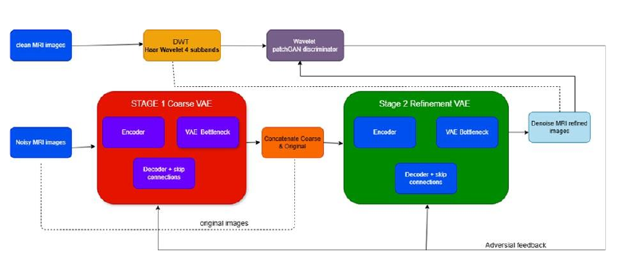
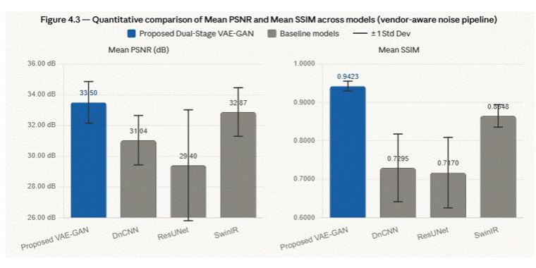
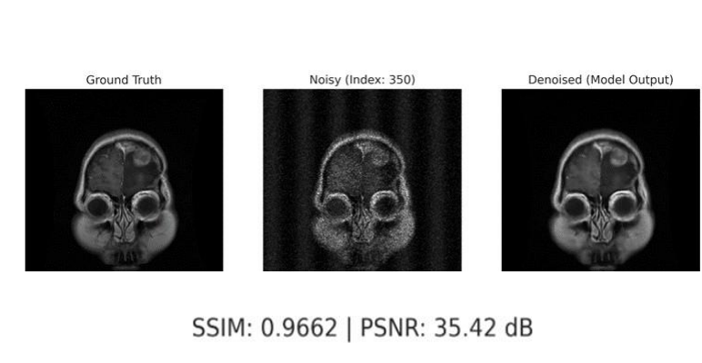

# Dual-Stage VAE-GAN with Wavelet PatchGAN for MRI Denoising

An academic computer vision project exploring MRI restoration across multiple synthetic noise conditions. The proposed workflow combines a variational coarse-reconstruction stage, a high-frequency refinement stage, noise-sensitive spatial attention, and a wavelet-domain PatchGAN discriminator.

[](https://colab.research.google.com/github/SD-Abilesh/mri-dualstage-vaegan-dwt/blob/main/notebooks/main/all_noise_combined_dualstage_vaegan_dwt.ipynb)



## Project overview

The experiments use 1,297 glioma MRI slices and cover Rician, Gaussian, speckle, Poisson, periodic, multiplicative, combined, and vendor-style synthetic corruptions. The repository retains the different notebooks because they document the noise comparisons and architectural ablations carried out during development.

The model family explores:

- two-stage coarse reconstruction and residual refinement;
- variational bottlenecks with KL-divergence warm-up;
- discrete wavelet transform features in a PatchGAN discriminator;
- reconstruction, adversarial, structural, and frequency-aware losses;
- PSNR, SSIM, MSE, residual maps, and qualitative comparisons;
- no-VAE and no-DWT architectural ablations.

## Results reported in the project report

The following values are transcribed from the accompanying capstone report. They are preserved as the project's original reported results and have not been independently reproduced in this repository.

| Experiment | PSNR | SSIM |
|---|---:|---:|
| Best individual-noise case (Rician, sigma 0.03) | 37.52 dB | 0.9624 |
| Combined/vendor-aware experiment | 33.50 dB | 0.9423 |

The report's comparison table lists the combined/vendor-aware model against the following baselines:

| Model | PSNR | SSIM |
|---|---:|---:|
| Proposed model | 33.50 dB | 0.9423 |
| SwinIR | 32.87 dB | 0.8648 |
| DnCNN | 31.04 dB | 0.7295 |
| ResUNet | 29.40 dB | 0.7170 |



### Evaluation limitation

Several supplied notebooks point both the training and validation loaders to the same image directory. Their stored validation metrics and validation-selected checkpoints therefore do **not** represent performance on a separate held-out validation set. The notebooks and outputs are retained as a record of the original project, but the reported values should be rerun with patient-level train, validation, and test splits before they are used as research evidence.

This disclosure does not make the individual notebooks redundant: they still record the ablation study and the comparison of different synthetic noise models.

## Qualitative output

The report includes clean, corrupted, restored, residual, and attention visualisations. A representative saved comparison is shown below; the full-resolution figures and methodology are available in the [project report](report/mri_denoising_capstone_report.pdf).



## Repository structure

```text
.
├── assets/                      # Architecture and result figures from the report
├── notebooks/
│   ├── main/                    # Combined-noise workflows
│   ├── individual-noise/        # Noise-specific experiments
│   ├── ablations/               # No-VAE, no-DWT, and comparison notebooks
│   └── README.md                # Notebook-by-notebook guide
├── report/
│   └── mri_denoising_capstone_report.pdf
├── requirements.txt
└── README.md
```

Start with [`all_noise_combined_dualstage_vaegan_dwt.ipynb`](notebooks/main/all_noise_combined_dualstage_vaegan_dwt.ipynb). A second combined-noise notebook is retained because its stored output corresponds more closely to the result presented in the report. See the [notebook guide](notebooks/README.md) for the complete experiment map.

## Running the notebooks

1. Open a notebook in Google Colab or a local environment with a CUDA-capable PyTorch installation.
2. Install the packages in `requirements.txt`.
3. Replace the original `/content/drive/MyDrive/Final RI/...` paths with your dataset and output locations.
4. Keep clean and corrupted images paired consistently by filename.
5. For a new evaluation, create patient-level train, validation, and test splits before training.

Datasets, checkpoints, generated noisy-image folders, and other large artifacts are excluded. The notebooks retain saved cells and outputs for portfolio review; they are not presented as a one-command reproducible research release.

## Scope

This is an academic prototype created to demonstrate work in generative image restoration, frequency-domain computer vision, medical imaging, and comparative experimentation. It is not intended for clinical use.

